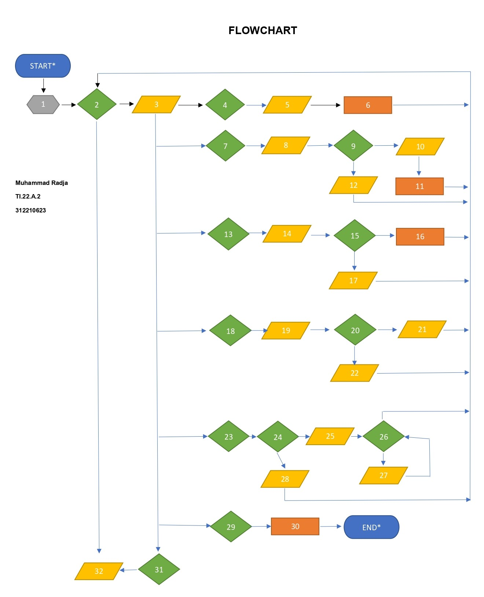

#### Keterangan Flowchart : 
1. ```Data = {}```
2. ``` while True:```
3. ```List = input("\n(T)ambah, (U)bah, (H)apus, (C)ari, (L)ihat, (K)eluar: ")```
4. ```if List.lower() == 't':```
5. ```print("Tambah Data"), nama = input("Nama : "), nim = int(input("NIM : ")), uts = int(input("Nilai UTS : ")), uas = int(input("Nilai UAS : ")), tugas = int(input("Nilai Tugas : "))```
6. ```akhir = tugas*30/100 + uts*35/100 + uas*35/100, Data[nama] = nim, uts, uas, tugas, akhir```
7. ```elif List.lower() == 'u':```
8. ```print("Ubah Data"), nama = input("Masukkan Nama : ")```
9. ```if nama in Data.keys():```
10. ```nim = int(input("NIM : ")), uts = int(input("Nilai UTS : ")), uas = int(input("Nilai UAS : ")), tugas = int(input("Nilai Tugas : "))```
11. ```akhir = tugas * 30 / 100 + uts * 35 / 100 + uas * 35 / 100, Data[nama] = nim, uts, uas, tugas, akhir```
12. ```print("Nama {0} tidak ditemukan".format(nama))```
13. ```elif List.lower() == 'h':```
14. ```print("Hapus Data"), nama = input("Masukkan Nama : ")```
15. ```if nama in Data.keys():```
16. ```del Data[nama]```
17. ```print("Nama {0} Tidak Ditemukan".format(nama))```
18. ```elif List.lower() == 'c':```
19. ```print("Cari Data"), nama = input("Masukkan Nama : ")```
20. ```if nama in Data.keys():```
21. ```print("="*73), print("| Daftar Mahasiswa |"), print("="*73), print("| Nama | NIM | UTS | UAS | Tugas | Akhir |"), print("="*73), print("| {0:15s} | {1:15d} | {2:5d} | {3:5d} | {4:7d} | {5:7.2f} |" .format(nama, nim, uts, uas, tugas, akhir)), print("="*73)```
22. ```print("Nama {0} Tidak Ditemukan".format(nama))```
23. ```elif List.lower() == 'l':```
24. ```if Data.items():```
25. ```print("="*78), print("| Daftar Mahasiswa |"), print("="*78), print("|No. | Nama | NIM | UTS | UAS | Tugas | Akhir |"), print("="*78), i = 0```
26. ```for j in Data.items():```
27. ```i += 1, print("| {no:2d} | {0:15s} | {1:15d} | {2:5d} | {3:5d} | {4:7d} | {5:7.2f} |" .format(j[0][:13], j[1][0], j[1][1], j[1][2], j[1][3], j[1][4], no=i)), print("=" * 78)```
28. ```print("="*78), print("| Daftar Mahasiswa |"), print("="*78), print("|No. | Nama | NIM | UTS | UAS | Tugas | Akhir |"), print("="*78), print("| TIDAK ADA DATA |"), print("="*78)```
29. ```elif List. lower() == 'k':```
30. ```break```
31. ```else:```
32. ```print("Pilih menu yang tersedia")```
